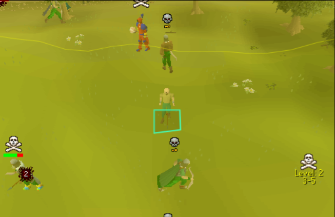

# Wilderness Sentinel

A Wilderness protection plugin for RuneLite that alerts you when threatening players are nearby, with configurable filters to reduce false alerts.

---

## Features

### Threat Detection
Stack multiple filters to narrow down exactly which players trigger the alarm:

- **Only attackable players** - filters by your combat level range for the current wilderness level
- **Only skulled players** - only alert on players who have initiated PvP combat
- **Only dangerous weapons** - only alert on players carrying known PK weapons (whips, claws, godswords, toxic staff, ballista, and 90+ more)
- **Custom alert item IDs** - add your own item IDs to the dangerous equipment list

Enable all three together to only alert on skulled players within your combat range who are carrying PK weapons.

### Player Highlights
Visual indicators on players who pass all your filters:

- **In-game outline** - coloured hull outline around threatening players
- **Overhead label** - shows combat level and skull status
- **Minimap dots** - coloured dots for threats on the minimap
- **Configurable** - colour, outline thickness, and dot size

### Smart Ignore List
Exclude players you trust:

- Friends, clan members, and friends chat
- Blocked players from your in-game ignore list
- Custom ignore list with specific player names
- Player timeout - stop alerting after a player has been nearby for a set duration
- Ferox Enclave safe zone detection

### Screen Flash
Full-screen flash overlay when a threat is detected:

- Configurable colour with transparency
- Multiple flash speeds (off, slow, normal, fast, solid)
- Render layer control

### Notifications
RuneLite notification when a threat is detected - configure sound, tray popup, and flash independently.

### Additional
- **PvP world support** - alert everywhere on PvP and Deadman Mode worlds
- **Combat level formula** - uses the correct Wilderness level +/- your combat level calculation
- **Ferox Enclave** - automatically excludes players inside the safe zone

---

## Configuration

| Section | Options |
|---------|---------|
| **General** | Alarm radius, player timeout, PvP world alerts |
| **Threat Detection** | Attackable filter, skull filter, weapon filter, custom item IDs |
| **Ignore List** | Friends, clan, friends chat, blocked, custom names |
| **Player Highlights** | In-game outline, overhead label, minimap dots, colour, thickness, dot size |
| **Notifications** | Player spotted notification |
| **Screen Flash** | Flash colour, speed, render layer |
