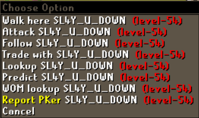
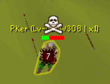
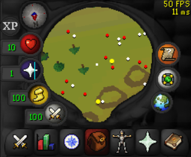
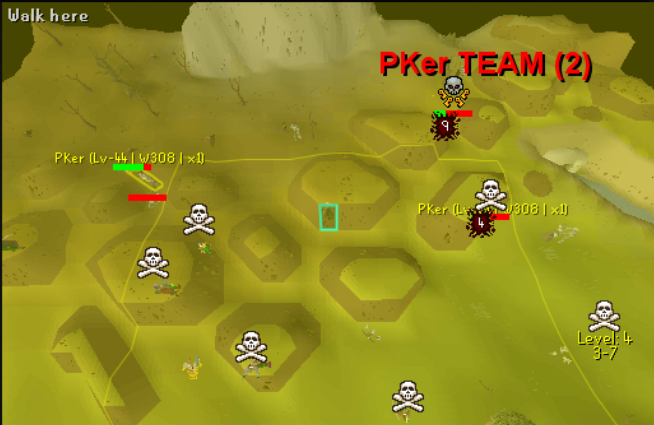
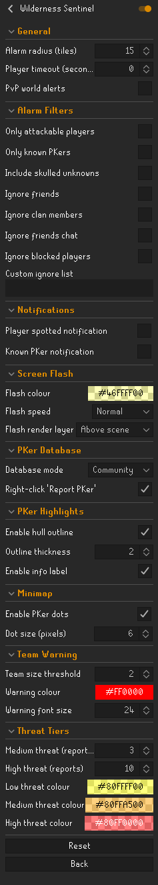

# Wilderness Sentinel

A comprehensive Wilderness protection plugin for RuneLite that detects, tracks, and alerts you to PKer threats using a community-powered database.

---

## Features

### PKer Detection & Alerts
Automatically detects when another player enters your vicinity in the Wilderness and triggers configurable alerts  - screen flash, sound notifications, and visual overlays.

- **Configurable alarm radius** (0-30 tiles)
- **Combat level filtering**  - only alert for players within your attackable combat range based on the current wilderness level
- **Skulled player detection**  - optionally alert for unknown skulled players who have initiated PvP combat
- **PvP world support**  - trigger alerts anywhere on PvP and Deadman Mode worlds

### Community PKer Database
A shared, crowd-sourced database of known PKers. When a player attacks you, their name is automatically reported to the server. All plugin users benefit from each other's reports.

- **Automatic reporting**  - attackers are recorded instantly when they hit you
- **Manual reporting**  - right-click any player in the Wilderness and select "Report PKer"
- **Community & personal modes**  - switch between the shared database or your own reports only
- **Real-time sync**  - PKer list updates every 10 seconds from the server
- **7-day expiry**  - inactive PKers are automatically removed after 7 days without a sighting

### Threat Tier System
PKers are colour-coded by how many unique users have reported them, giving you an instant threat assessment.

- **Low threat** (yellow)  - reported by 1-2 users
- **Medium threat** (orange)  - reported by 3+ users
- **High threat** (red)  - reported by 10+ users
- **Fully customisable**  - adjust thresholds and colours for each tier

### In-Game PKer Highlights
Known PKers are visually highlighted in the game world with a coloured hull outline and an info label showing their combat level, last seen world, and report count.

- **Hull outline**  - coloured border around the PKer's character model
- **Info label**  - displays "PKer (Lv-126 | W319 | x5)" above their head
- **Configurable**  - toggle outline and label independently, adjust stroke width

### Minimap Indicators
Known PKers appear as coloured dots on the minimap, making it easy to track their position relative to you.

- **Colour-coded by threat tier**
- **Configurable dot size** (2-12 pixels)
- **Toggle on/off independently**

### PKer Team Warning
When multiple known PKers are detected nearby simultaneously, a prominent on-screen warning alerts you to a potential PKer team or clan.

- **Configurable threshold**  - set the number of PKers needed to trigger (default: 2)
- **Customisable appearance**  - adjust warning text colour and font size

### Separate Notifications
Configure different notifications for general player sightings and known PKer detections  - use distinct sounds, tray popups, or flash patterns to tell them apart instantly.

- **Player spotted notification**  - triggers for any alarming player
- **Known PKer notification**  - separate notification specifically for database matches, overrides the general alert

### Smart Filtering
Fine-grained control over which players trigger the alarm.

- **Friends, clan, and friends chat**  - automatically ignored
- **Blocked players**  - optionally ignore your in-game block list
- **Custom ignore list**  - comma-separated player names to never alert on
- **Player timeout**  - stop alerting for a player after they've been nearby for a set duration
- **Ferox Enclave safe zone**  - players inside Ferox Enclave are automatically excluded

### Sidebar Panel
A dedicated RuneLite sidebar panel for browsing and searching the PKer database.

- **PKer list**  - all known PKers sorted by report count, colour-coded by threat tier
- **Search**  - filter the local list by typing, or press Enter to search the server
- **Wilderness hotspots**  - shows which wilderness level ranges have the most PKer activity

### Last Seen Tracking
The plugin tracks when and where known PKers were last seen active, keeping the database fresh and relevant.

- **World tracking**  - records which OSRS world a PKer was last spotted on
- **Activity detection**  - updates when a known PKer is seen skulled or attacking another player
- **Automatic cleanup**  - PKers not seen for 7 days are removed from the database

---

## Configuration

All settings are organised into logical sections in the RuneLite plugin configuration panel:

| Section | Options |
|---------|---------|
| **General** | Alarm radius, player timeout, PvP world alerts |
| **Alarm Filters** | Combat level filter, known PKers only, skulled unknowns, friend/clan/chat ignores, custom ignore list |
| **Notifications** | Player spotted notification, known PKer notification |
| **Screen Flash** | Flash colour, speed, render layer |
| **PKer Database** | Community/personal mode, right-click report menu |
| **PKer Highlights** | Hull outline toggle/thickness, info label toggle |
| **Minimap** | PKer dots toggle, dot size |
| **Team Warning** | Threshold, warning colour, font size |
| **Threat Tiers** | Medium/high report thresholds, low/medium/high colours |

---

## Installation

Install from the RuneLite Plugin Hub  - search for "Wilderness Sentinel".

---

## How It Works

1. **Detection**  - every game tick, the plugin scans for players within your alarm radius
2. **Filtering**  - each player is checked against your configured filters (friends, combat level, known PKers, etc.)
3. **Alerting**  - if a player passes all filters, the alarm triggers with your configured notifications and overlays
4. **Reporting**  - when you're attacked, the attacker's name is automatically sent to the community database
5. **Syncing**  - the PKer list refreshes from the server every 10 seconds, keeping your data current
